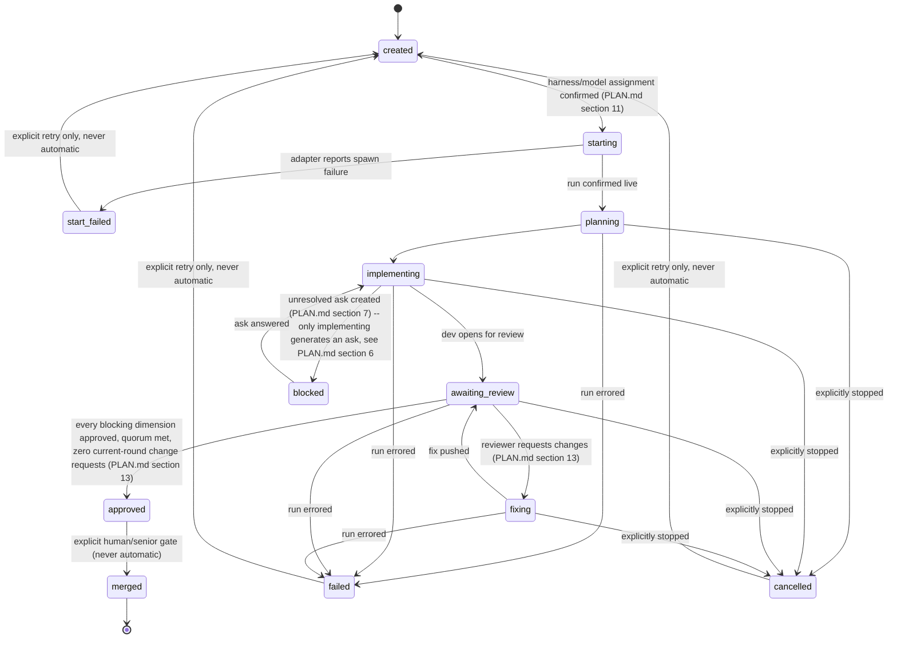
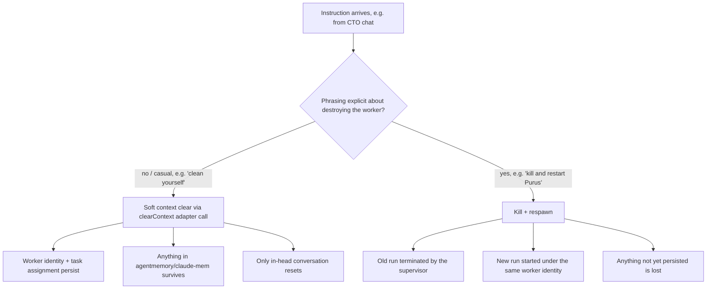
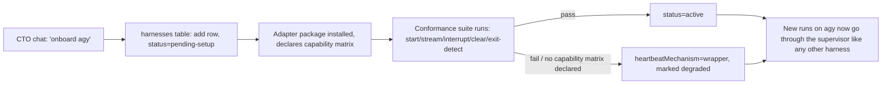
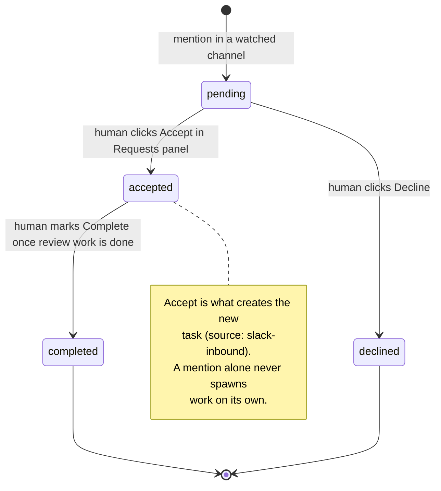
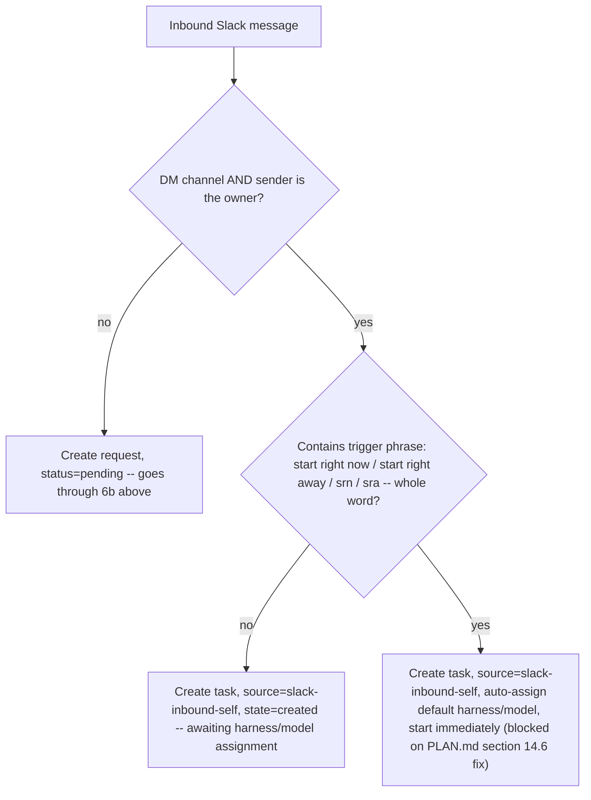

# Flows, Diagrams & Keybindings

## 1. Task state machine



Note: state names use underscores here for mermaid syntax validity; the canonical value
in the database (PLAN.md section 3, section 6) is hyphenated (`awaiting-review`,
`start-failed`) — same state, rendering constraint only. `superseded`/`reopened`/
`merge-rejected` are deliberately not modeled yet (PLAN.md section 6) — add only when a
real flow needs them. `failed`/`cancelled` are reachable from any in-flight state
(planning/implementing/awaiting_review/fixing) by design — see PLAN.md section 6 for
why that's broader than `blocked`, which is implementing-only.

## 2. Session lifecycle (clean vs. kill)



`clearContext` (PLAN.md section 4, section 7) is a real per-harness adapter capability,
not an assumption that "clear" means the same operation on every harness — proven in
the Phase 0b runtime spike before this flow is built.

## 3. Escalation ("ask") flow — the approval control plane

```mermaid
sequenceDiagram
    participant W as Worker (e.g. Purus)
    participant S as Supervisor (control socket)
    participant D as Database (asks table)
    participant U as Dashboard UI (tree pane)
    participant M as Manager (CTO / lead)
    W->>S: approval.request event / ask needed
    S->>D: insert ask row {id, runId, question, resolved:false}
    D->>D: task.state -> blocked (PLAN.md section 6)
    D->>U: badge appears on worker in tree ("?")
    U->>M: visible next time manager looks at tree
    M->>S: answer over control socket
    S->>D: persist answer, THEN set resolved=true (ordering matters — see PLAN.md section 7)
    D->>U: badge clears; task.state -> implementing
```

This is not a notification nicety — it is the mechanism that prevents a headless
session from deadlocking on a permission decision (PLAN.md section 7). It ships in the
first vertical slice (ROADMAP Phase 2), not deferred.

## 4. Onboarding a new harness



Runtime research-and-generate of a brand-new adapter (the original flow) is backlog
(PLAN.md section 9) — v1 registers pre-installed, versioned, conformance-tested
adapters only.

## 5. Keybinding -> situation -> result table

This is the reference for "when you press this and the situation is this, it shows
this." All keybindings act on the **currently focused pane context** (a team selected
in the top bar + tree), not globally.

| Key | Situation | Result |
|---|---|---|
| `<-` / `->` or `h` / `l` | Top team bar has more teams than fit on screen | Move selection across the team bar |
| Click a team in top bar | — | That team becomes active; tree + panes scope to it |
| Click a worker in tree | — | Opens that worker's pane directly, full focus |
| Click a task node in tree | Task type = `dev` | Shows last-active dev run pane (most-recent-message, unless pinned) |
| Click a task node in tree | Task type = `review` | Shows dev pane + one reviewer pane (parent by default) side by side |
| Click a worker, then `m` | — | Pins that worker's run as `mainWorkerId` for the task — overrides most-recent-message default until unpinned |
| Click a worker, then `v` | — | Opens a quick effort/variant picker scoped to that one run (PLAN.md section 11) — Claude Code's "effort" and OpenCode's "variant" shown as one generic control; changes the running instance only, not the stored default |
| Click the Requests panel, then `h` | Requests panel focused (backlog feature — PLAN.md section 14.4) | Hides the panel, returns to default pane layout (see section 6a — same `h` key, scoped by focus, not a collision) |
| `1` | Review pane open | Toggle Reviewer 1 pane on/off |
| `2` | Review pane open | Toggle Reviewer 2 pane on/off |
| `p` | Review pane open | Toggle Parent-reviewer pane on/off |
| `r` | Any reviewer pane visible | Toggle **all** reviewer panes off at once ("just show me the coder") |
| `r` (again) | All reviewer panes hidden | Restore last-shown reviewer pane state |
| — | All reviewer panes hidden (via `r` or individually) | Dev pane auto-expands to fill width — no dead space |
| `f` | Any pane focused | Fullscreen that pane |
| `f` (again) | Pane is fullscreen | Return to split/group view |
| `g` | — | Toggle grouped/split view vs. single-pane view |
| `d` | A worker's pane is focused | Toggle bottom bar target from CTO chat to direct chat with that worker (`> Purus (direct)`) |
| `d` (again) | Bottom bar targeting a worker directly | Return bottom bar target to CTO |
| `/` | Anywhere | Focus jumps to the bottom chat bar |
| chat: `"hide <team>"` | Team currently shown in top bar | Sets `hiddenFromTopBar: true` — view filter, not delete |
| chat: `"move <name> -> <team>"` | — | Typed supervisor command (`moveWorker`) — no drag-and-drop, no separate agent (PLAN.md section 16) |
| chat: `"onboard <harness>"` | New CLI not yet registered | Triggers onboarding flow, see diagram 4 |
| chat: `"@<nickname> <task>"` (adhoc) | Single worker, no team ceremony needed | Creates a `type: adhoc` task, `source: manager-direct` or `direct-message`, starts via the supervisor's normal `start()` call (PLAN.md section 4, section 10) |

## 6. Layout wireframe (static reference)

```
+- TEAMS (online) --------------------------------------------- <- -> -+
|  [Vite Migration]  [Biome Lint]  [Stripe Fix]  [Checkout] ...       |
+-----------+-----------------------------------------------------------+
| TREE 15%  |  PANE AREA                                               |
| > team    |  +-------------------+---------------------------+      |
|   lead    |  |  DEV PANE          |  REVIEW PANE (toggleable) |      |
|   |-dev   |  |  (last-active dev  |  Parent reviewer or       |      |
|   |-rev1  |  |   run, or          |  Reviewer 1 / Reviewer 2  |      |
|   `-rev2  |  |   pinned "main")   |  (pick via bottom toggle) |      |
|           |  +-------------------+---------------------------+      |
+-----------+-----------------------------------------------------------+
| [1] rev1  [2] rev2  [p] parent-rev  [r] all-rev  [f] fullscreen      |
| [g] group/split   [h/l] switch team   [d] direct-chat  [/] focus chat|
+-------------------------------------------------------------------------+
| > (CTO chat -- always resident)                                       |
+-------------------------------------------------------------------------+
```

## 6a. Requests panel (backlog — PLAN.md section 14.4; top-left, height configurable, default ~12%)

```
+- TEAMS (online) --------------------------------------------- <- -> -+
|  [Vite Migration]  [Biome Lint]  [Stripe Fix]  [Checkout] ...       |
+-----------+-----------------------------------------------------------+
| REQUESTS ~12% (configurable) --------------+  TREE 15% resumes below |
| [Accepted] [Declined] [Completed] [Team Requests]                   |
| > @nj in #your-mr-channel: "@you please review..."                  |
+-----------+-----------------------------------------------------------+
| TREE 15%  |  PANE AREA (unchanged from section 6)                    |
| ...       |  ...                                                     |
+-----------+-----------------------------------------------------------+
```

- Collapsed by default when there are zero pending requests; appears the moment one
  lands. Click into it, press `h` to hide again (table row above) — the panel does not
  permanently take screen space when there's nothing to triage.
- When a request's raw message is shown, the button row may collapse to keep the whole
  panel within its configured height rather than growing the panel.

## 6b. Review-request lifecycle (backlog)



Team-requests (sprint changes, ticket-ID asks, reassignment) get their own button and
queue, same pending/accepted/declined shape — the resolution logic for that bucket is
intentionally left open per PLAN.md section 14.2 ("more we can leverage later").

**Self-DM exception, two gates** (PLAN.md section 14.2): if the message is in the
owner's own DM with the bot *and* sent by the owner (gate 1), it skips straight to task
creation — `source: "slack-inbound-self"` — never enters `pending`. It still lands in
`created` (PLAN.md section 6), waiting on harness/model assignment, unless the message
*also* contains a trigger phrase (gate 2) — "start right now", "start right away",
`srn`, or `sra`, whole-word matched — in which case it auto-assigns defaults and starts
immediately. **Gate 2's auto-start cannot actually ship until PLAN.md section 14.6's
local DM-reading gate is fixed** — the originally specified password mechanism checks a
pull path (`conversations.history`) but Slack delivers DMs via a push event
subscription, so it never runs on the path it's meant to protect. This diagram
describes the intended behavior once 13.6 has a working replacement; do not build gate
2's auto-start against the old mechanism.


