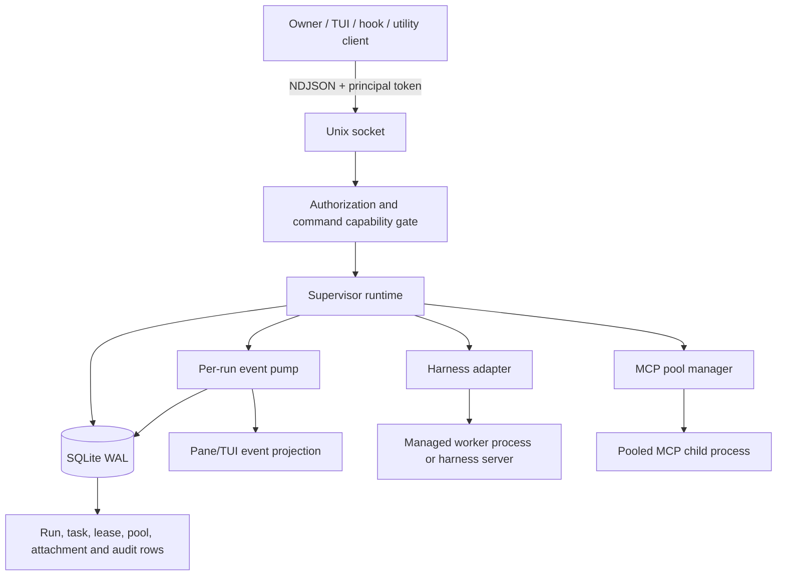
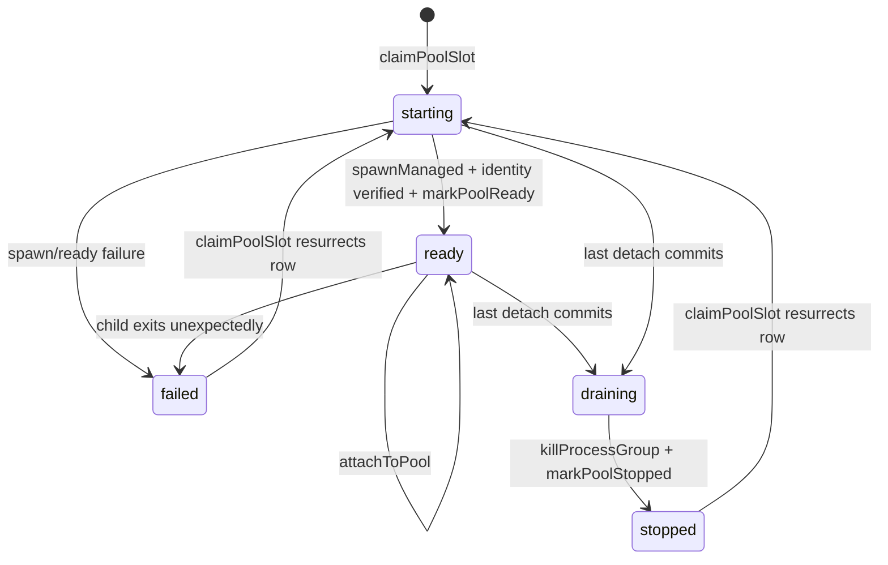
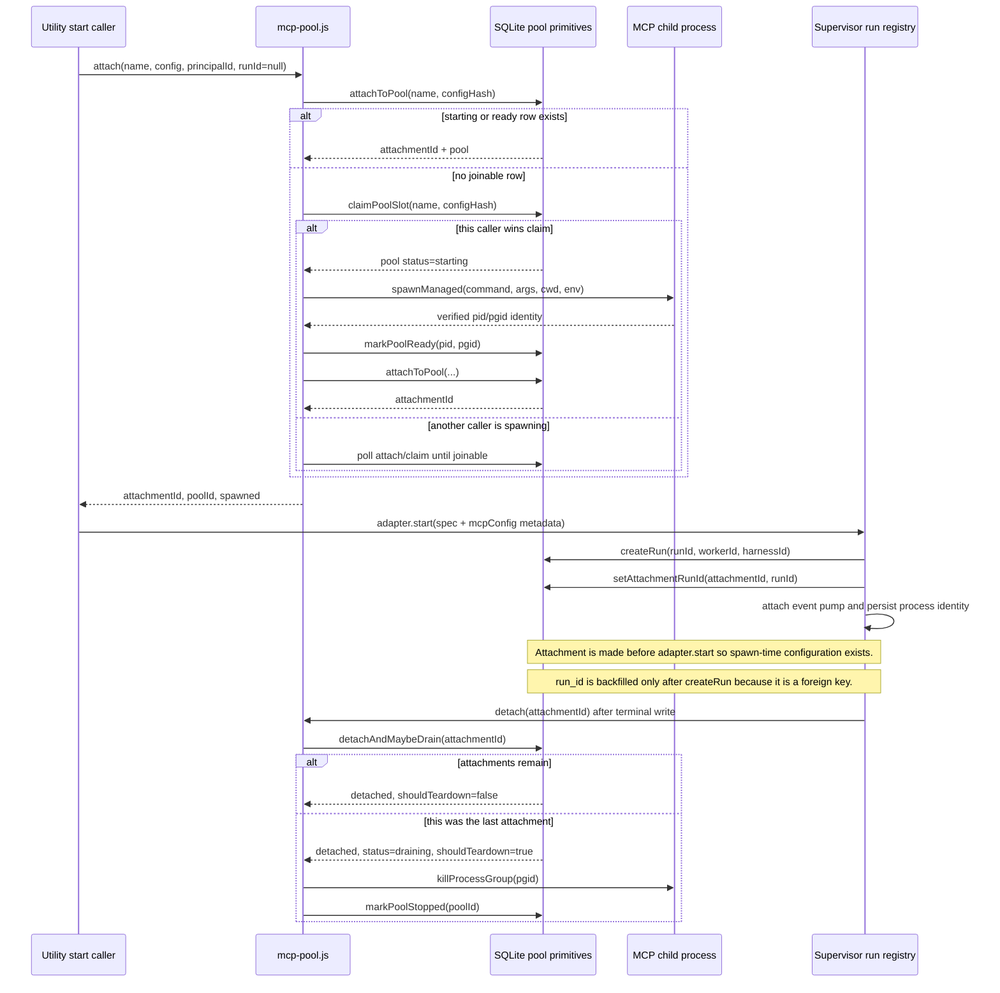

# Architecture Account: MCP Pooling and the Utility Task Lane

> **STALE SNAPSHOT — dated 2026-09-11, NOT regenerated since. Corrected 2026-09-13
> (review-sol-2026-09-13.md finding 45).** Read as a dated historical account, not current-tree fact —
> `HANDOFF.md`'s top header is the current-state source of truth and this file does not track it.

Reviewed 2026-09-11 against the current working tree. The principal sources were
`HANDOFF.md`, `PLAN.md`, `ROADMAP.md`, and the implementation under
`supervisor/db`, `lock`, `ipc`, `adapters`, `runtime`, `domain`, `pane`, `tui`,
`agents`, and `config`. This document describes the code that exists now, not the
larger future architecture in the planning documents.

## System Shape

The supervisor is a local Node daemon. It owns the SQLite database, starts and
stops harness and MCP processes, and exposes mutations through an authenticated
newline-delimited JSON Unix socket. The TUI, pane client, hooks, and future
utility dispatchers are clients; they are not database writers.



The lock is scoped to the selected state directory. The database migrations are
serialized with an immediate transaction; pool and lease admission use the same
database-level discipline. Process ownership is recorded with PID/PGID evidence,
and startup reconciliation does not trust a live-looking row without checking the
OS.

## MCP Pool Identity

A pool is identified by `(name, config_hash)`, not by name alone. The hash is
computed from the spawn configuration. The unique index makes one durable pool
row represent one configuration identity. Migration 0013 adds lifecycle state
and `mcp_pool_attachments`; the attachment rows, not the retained legacy
`refcount` column, are authoritative for the number of live clients.



`draining` is deliberately not joinable. This is the key race decision: a new
attach either commits before the last detach transaction and is counted, or sees
`draining` and starts/reclaims a separate lifecycle. It cannot attach to a
process whose teardown has already been decided.

## MCP Pool Lifecycle



### Boot reconciliation

`createMcpPool()` starts with an empty in-memory `liveChildren` map. Therefore a
persisted `starting` or `ready` pool from an earlier daemon process is not
reattachable: its `ChildProcess` handle and streams do not survive a restart.
`reconcileOnBoot()` checks PID liveness, kills a still-live owned process group,
and marks the row `failed`; a later attach starts a usable replacement. This is
intentional conservative recovery, not full MCP session reattachment.

Run reconciliation is separate. A run classified `lost` causes the supervisor
to schedule detachment of its open MCP attachments. Normal `endRun`, `stop`, and
`releaseSession` also schedule detach after the terminal database write. Detach
is best effort and asynchronous so process-group grace periods cannot delay the
run's own terminal result.

## Utility Task Lane

The utility lane reuses the ordinary task and run machinery. The four current
profiles are `git-push-task`, `jira-task`, `awsquery-task`, and `slack-task`.
Each resolves to one dedicated role, a cheap `haiku`/`low` built-in default, a
fixed utility capability preset, and zero required review verdicts. Zero review
does not remove the explicit human gate for a `merged` task state; these are
mechanical task profiles, not autonomous authority.

```mermaid
flowchart LR
  T[createTask(type=utility-task)] --> P[profileFor + rolesFor]
  P --> W[Find worker with dedicated utility role]
  W --> D[planAssignment + harness-defaults]
  D --> C{isActionable via profile.workRoles?}
  C -- no --> F[Remain created; report unfillable]
  C -- yes --> I[Claim assignment before spawn]
  I --> ST[created -> starting]
  ST --> SR[start each startable slot]
  SR --> X{Any worker started?}
  X -- no --> SF[start-failed]
  X -- yes --> PL[planning / implementing path]
  PL --> E[Worker operation / utility result]
  E --> END[endRun or stop / releaseSession]
  END --> DET[Detach MCP attachment]
  DET --> FIN[Terminal run and task bookkeeping]
```

`assignTask()` first checks an idempotency record, resolves workers and defaults,
and writes the in-progress assignment record before invoking `start()`. It keeps
successful partial starts and records failed slots as blockers. `start()` then:

1. Resolves and rotates the worker principal. A per-run token is placed in the
   child environment when the harness supports per-run delivery.
2. Looks up the worker role and `ROLE_MCP_NEEDS`.
3. Loads the named pool configuration on demand. The built-in `leo-mcp` config
   points to the sibling `leo-mcp` repository.
4. Attaches to each declared pool before calling the harness adapter, because
   configuration must exist at spawn time.
5. Starts the adapter, obtains its `runId`, and creates the `runs` row.
6. Backfills each attachment's `run_id`, attaches the single event pump, and
   records verified process identity.

If run persistence fails after an adapter has started, `start()` stops the child
and detaches the pre-run attachments. This prevents an untracked managed process.
The attachment foreign key explains the ordering: an attachment cannot be
backfilled until its run row exists.

Terminalization is centralized in `closeAndScheduleAsks()`. `endRun` is guarded
by `ended_at IS NULL`, so the first terminal writer wins. Deliberate stop/reap
intent is retained so the event pump cannot replace a truthful deliberate reason
with a derived stream error. The same terminal transaction releases leases; MCP
detach is then scheduled asynchronously. A naturally self-ended run gets ask
grace; deliberate or lost termination closes asks immediately.

## What “Lazy MCP Routing” Means Here

The role manifest is a minimal set selection, not a per-turn tool discovery
protocol. Investigation found no harness control that defers arbitrary MCP tool
schemas by name. Claude's available lever is an explicit `--mcp-config` set, and
OpenCode does not provide the needed equivalent in this adapter. The current
implementation therefore narrows the declared pool set by role and records pool
attachments, but does not implement a brokered catalog or invocation router.

Most importantly, `mcp-pool.js` currently speaks stdio to the pooled child owned
by the supervisor. A separately spawned worker CLI cannot connect to that child
through the `{ name, poolId }` metadata placed in `spec.mcpConfig`; naming the
same command in a normal MCP config would spawn another process. A non-stdio
transport and an authenticated per-client broker are required before this is a
genuine shared worker connection.

## Verification Surface

The relevant proof is in `supervisor/runtime/test/mcp-pool.test.js` and
`mcp-pool-wiring.test.js`, plus database lease/pool concurrency tests. The wiring
tests cover a real utility-role start, pool and attachment rows, detach on stop,
non-utility isolation, concurrent same-config sharing, and detachment after a
lost-run reconciliation. They do not prove a separately spawned Claude process
can use the pooled MCP server, because that transport does not exist yet.
