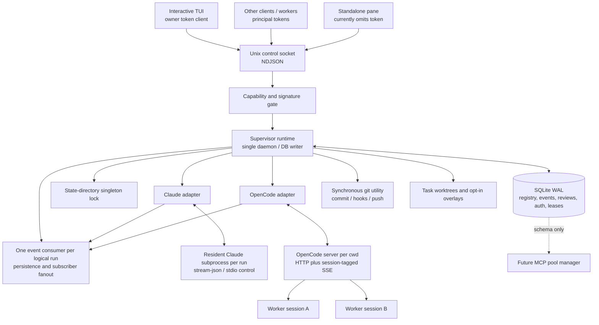
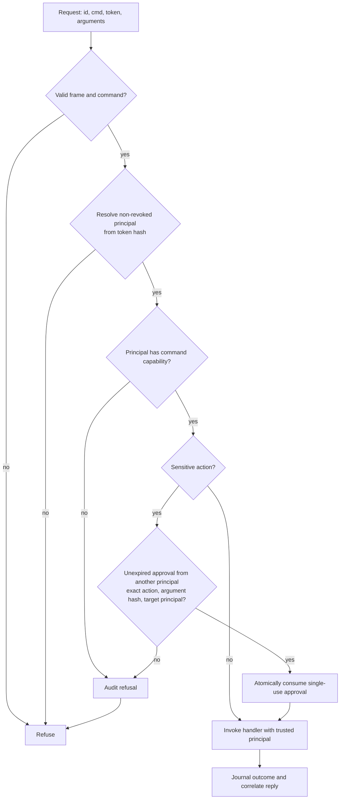
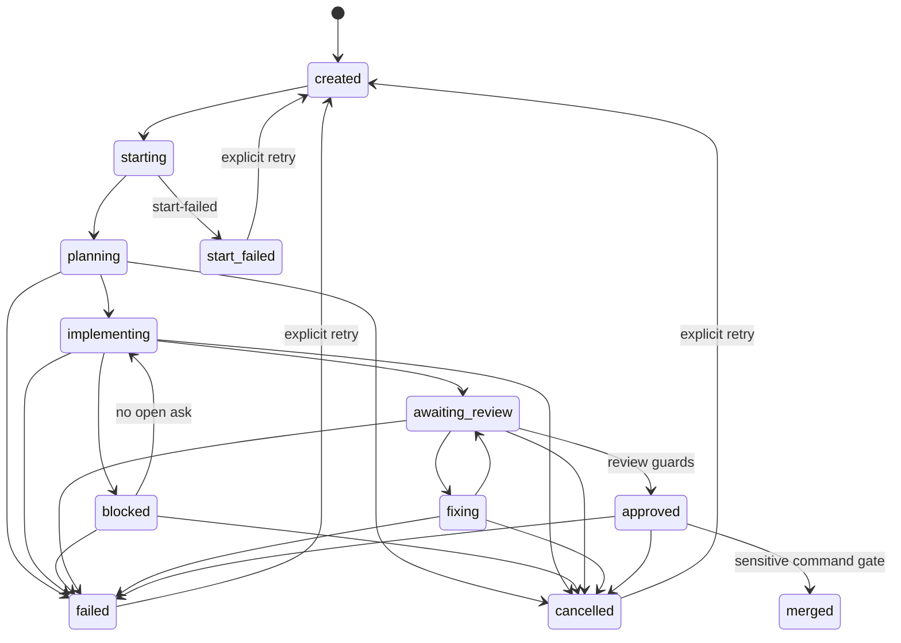

# Architecture as built

> **STALE SNAPSHOT — dated 2026-09-11, NOT regenerated since. Corrected 2026-09-13
> (review-sol-2026-09-13.md finding 45).** This document mixes pre-fix findings with current-state
> claims from the moment it was written (e.g. migrations ending at 0012 — the tree is at 0016 as of
> this correction; MCP metadata claimed delivered in `spec.mcpConfig` — it explicitly is not, see
> `HANDOFF.md`'s top header). Read it as a dated historical account, not a description of the current
> tree. `HANDOFF.md`'s own top header is the current-state source of truth; this file is not updated to
> track it.

Reviewed 2026-09-11 against the working tree based on `d7c4771`, including the uncommitted lease, worktree, utility-profile, and git-agent changes. Read order: HANDOFF.md, all 21 sections of PLAN.md, ROADMAP.md, then implementation and tests. This is an independent account of the implementation, not a replacement for HANDOFF.md. Relative source links refer to this checkout.

## What exists

This is a local Node supervisor with a durable SQLite registry, real harness integrations, a Unix-socket control plane, and terminal views. It already has substantial process ownership, restart reconciliation, approval routing, review evaluation, and authorization machinery. It is not yet the autonomous team orchestrator described by PLAN.md: there is no implemented CTO dispatch loop assembling and completing tasks through the whole lifecycle.

The distinction matters at the newest boundary. Resource leases and worktree commands execute real operations. The git utility executes real git commands. Utility task profiles exist but their assignments are rejected by the generic assignment gate. `mcp_pool` is a database table, not a running MCP pool. Jira/Slack dispatch and lazy tool discovery remain future work. See [REVIEW-NOTES.md](REVIEW-NOTES.md) for defects demonstrated independently of the existing suite.

## Processes, ownership, and storage



[`ipc/daemon.js`](../supervisor/ipc/daemon.js) acquires the singleton lock, opens the database, constructs the runtime with Claude and OpenCode adapters, boots reconciliation, and starts the authorized socket server. Shutdown closes IPC first, then the runtime, database, and lock. Daemon packaging/lazy startup demonstrated in earlier spikes should not be confused with an installed production launcher.

[`paths.js`](../supervisor/paths.js) resolves one state root: `SUPERVISOR_STATE_DIR`, then legacy `CTD_STATE_DIR`, then `~/.custom-team-dashboard/supervisor`. It owns `state.sqlite3`, `supervisor.sock`, `supervisor.lock`, and `owner.token`. The directory is private; database sidecars and owner token are tightened to mode 0600. The lock implementation publishes a fully written temporary file using an atomic hard link, checks process liveness before stale takeover, and treats ambiguous/corrupt ownership conservatively. Its scope is the selected state directory, not every supervisor on the machine.

[`db/`](../supervisor/db/) uses synchronous `better-sqlite3`, WAL, foreign keys, busy handling, and transactional migrations through **0012**. The daemon is the intended single writer, although tests and exported primitives can open the database directly. Tables cover teams/workers/tasks/harnesses/runs, asks, raw and derived events, transition journals, outbox/requests/integrations, model health, handoffs, orphan observations, review profiles/verdicts, principals/audit/signatures, resource leases, and the future MCP pool. A table's existence does not imply a running dispatcher or UI workflow.

A **worker** is a durable role/task identity. A **run** is a logical execution identity with a harness session ID, process ownership evidence, and a mutable generation. Resume can reopen the same run row and replace its process generation; PLAN's description of an immutable process-generation record is not literally the current schema. `runs` does not retain its own task ID: task attribution is obtained through the worker's current assignment. That is an important future reassignment constraint.

[`runtime/spawn.js`](../supervisor/runtime/spawn.js) creates detached managed process groups, verifies ownership, propagates a depth guard, and handles asynchronous spawn failures. Stop/reap uses process-group termination with grace/escalation and zombie-aware inspection. [`runtime/reconcile.js`](../supervisor/runtime/reconcile.js) compares persisted PID/PGID/start-time evidence with the OS and adapter handles. Missing or mismatched processes become lost. A live process without a recoverable adapter handle becomes an unmanaged orphan, with sightings retained; it is not silently treated as controllable. Adopted external runs are visible but are not equivalent to supervisor-owned children. Shared OpenCode process groups receive sibling checks before destructive reap.

This is useful recovery accounting, not full harness reattachment after daemon death. Adapter session maps are in memory. OpenCode exposes additional server/session identity verification, but the main reconciliation seam currently relies on OS identity and handle availability rather than invoking that full check.

## Wire protocol and event transport

[`ipc/protocol.js`](../supervisor/ipc/protocol.js) and [`ipc/server.js`](../supervisor/ipc/server.js) implement newline-delimited JSON over a Unix socket. A request has a nonempty string `id`, a `cmd`, parameters, and normally a `token`. A normal reply correlates by `id` and includes `ok`; concurrent commands may finish in any order. Duplicate in-flight IDs are rejected.

```json
{"id":"req-1","cmd":"status","token":"<principal secret>"}
{"id":"req-1","ok":true}
```

The second line illustrates the envelope only; commands add their own payload. Streaming uses `{id, seq, event}`, gap notices `{id, gap, fromSeq}`, and a terminal `{id, ok:true, done:true}`. Peer-level overflow/shutdown notices can have a null ID. Complete and incomplete request frames are capped at 256 KiB, and disconnect aborts associated subscriptions.

[`runtime/event-pump.js`](../supervisor/runtime/event-pump.js) is the sole adapter-event consumer for each run. It persists tier-1 events and invokes derived-event handling before distributing events to independent subscriber cursors. Slow consumers receive explicit gaps from a bounded 2,000-event buffer. This bounds an event count, not total bytes or socket write queues: transport backpressure and global output budgets remain incomplete.

Turn completion and process lifetime are separate. The pump derives run completion from stream/turn terminal behavior even when a resident harness process survives. Resume can establish a fresh pump generation. Callers must not assume that a direct follow-up input automatically implements the entire task continuation lifecycle.

The production daemon exposes `authorizedCommandHandlers`; the raw `commandHandlers` map is a trusted in-process/testing seam. Several tests use the latter, so passing a wire test does not necessarily establish production authentication compatibility. The interactive TUI supplies the owner token; the standalone pane currently does not and fails against the authorized server.

## The two structured harness adapters

| Concern | Claude | OpenCode |
|---|---|---|
| Process model | Resident child per run | One `opencode serve` per cwd, multiple sessions |
| Input/events | Stream JSON on stdio | HTTP commands and shared SSE demultiplexed by session ID |
| Readiness | Initialization/control handshake | Health readiness, then SSE connection barrier |
| Interrupt | Control request | Session abort request |
| Context clear | `/clear`, with new session initialization | Session summarization/compaction |
| Resume | Existing adapter state; may launch replacement using `--resume` | Requires known in-memory run/session mapping |
| Parked tool approval | `can_use_tool` requests and matching `control_response`, generation checked | Advertised observe-only; no `answerApproval` implementation |
| Per-worker environment/MCP isolation | Explicit launch configuration supported | Per-run environment and MCP overrides refused for pooled server |

The current Claude adapter uses `-p --input-format stream-json --output-format stream-json --include-partial-messages --verbose`, with the stdio permission protocol. It is **not** the older hook-based approval design described in PLAN. Default settings isolation suppresses ambient settings/MCP configuration unless explicitly opted in. These launch choices are not a filesystem or command sandbox: native tools still exist.

OpenCode's server pool is in adapter memory and is distinct from the proposed cross-harness MCP pool. It owns a localhost server on a selected port, one SSE subscription, and session routing. Sessionless events are restricted to an explicit allowlist. Its pooled process cannot receive different environment credentials for each worker; the runtime labels that token-delivery path undeliverable rather than claiming isolation. Permission events do not presently form the complete supervisor ask/answer contract.

The separate wrapper adapter provides degraded text observation for a registered CLI. It is not a third fully equivalent structured integration. Capability/conformance checks distinguish real methods and behavior, and wrapper streams remain terminal-tier. Onboarding operates on registered adapters; it does not synthesize a new adapter from an arbitrary CLI name.

## Authorization and approvals

[`domain/capabilities.js`](../supervisor/domain/capabilities.js) declares command-to-capability mappings, presets, and sensitive actions. The server resolves a secret token by hash to a persistent, revocable principal, overwrites caller-supplied principal metadata, checks the mapped capability, and journals authenticated decisions. Unknown commands fail closed; `ping` is the deliberately unauthenticated exception.



Sensitive actions include protected git push, Slack as-user posting, and task merge. Approval is bound to canonicalized arguments and the target principal and consumed before execution. The approval issuer needs `approve:sensitive` and must be a different principal; this is not intrinsically a verified-human requirement. It also binds request arguments, not mutable repository contents or HEAD unless those are explicit validated arguments.

Presets are intentionally narrow at the command level: ordinary workers can read registry data, answer asks, use worktrees, and lease resources; reviewers add run observation and verdict recording; CTO can orchestrate runs/tasks and grant sensitive approvals; dedicated utilities receive git, Jira, Slack-bot, or registry-only powers. Owner has the full set. Worker credentials rotate on start. Same-UID processes with filesystem access to `owner.token` remain outside a strong sandbox boundary.

The current gate authorizes **command classes**, not complete object/action semantics. It does not by itself bind a verdict's `workerId` to its authenticated reviewer, limit a worktree operation to that worker's task, establish whether a push destination is protected, or make `tuiSnapshot` safe for an agent reader. Those are real missing checks, not guarantees supplied by the capability names.

Harness tool approvals are a second mechanism: adapter events create asks, an answer is validated against the pending request/generation, and the decision is forwarded to the adapter. They should not be confused with the two-principal sensitive-command signature. Ask creation/answering currently does not drive task blocked/unblocked transitions automatically, and wire answer attribution is not reliably derived from the principal.

## Task assignment, lifecycle, and reviews

The implemented transition rules are in [`domain/task-states.js`](../supervisor/domain/task-states.js); the database records state changes and the transition journal together. This is a guarded state engine, not yet a complete scheduler.



Diagram identifiers `start_failed` and `awaiting_review` represent stored `start-failed` and `awaiting-review`. There is no direct fixing-to-approved transition. Run failure is not synonymous with a persisted task failure; ask/task and run/task transitions still require orchestration wiring. There is no general task-creation/roster-management/transition wire API providing the whole planned workflow.

[`domain/assignment.js`](../supervisor/domain/assignment.js) resolves task profiles to role slots, existing workers, harness/model/effort defaults, and per-team overrides. The runtime persists an assignment idempotency claim before asynchronous starts. Partial startup keeps successful runs; total failure records start-failed. This protects replay of the same key, not every competing assignment with a different key or a daemon crash while the claim is in progress.

Default feature work requests a coder and two reviewers; bugs request a coder and one reviewer; review tasks use a parent reviewer; adhoc/chore profiles request a coder and zero reviews. Utility profiles request one dedicated role with zero reviews. However, `isActionable` recognizes only coder or parentReviewer, so all four utility profiles are refused even with the correct worker present. The default start prompt is only a task ID/type/role sentence; it does not inject a substantive goal, handoff, MCP bundle, or utility instruction contract. Worktree creation is a separate explicit operation, not automatically performed by assignment.

Review configuration resolves inherited profiles into hashed persisted definitions. The default profile has blocking correctness/security/tests dimensions, optional simplification/performance dimensions, two distinct reviewers, and a parent that does not count by default. Per-team/path overrides exist. Profiles are imported at boot or explicitly, not continuously watched.

`recordVerdict` checks task membership, role, profile dimension, and task terminal state and derives the slot from the worker rather than trusting the supplied slot. Verification is injectable; without a verifier, findings remain unverified. Refuted findings are retained in storage but filtered from delivered/ranked findings. A per-task promise lock serializes asynchronous verification and approval evaluation.

Evaluation uses the latest verdict round, dimension decisions, distinct reviewer identities, and optional revision binding. Stale approvals are excluded when revision binding applies; change requests in the selected round still matter. Current round selection and commit evidence require careful caller orchestration. The generic review evaluator is not reconciled with zero-review task profiles, and the `parentReviewer` assignment role is not accepted by the verdict path's exact `reviewer` role check. `mergeTask` records a state transition; it does not execute git merge or independently establish a fresh reviewed HEAD.

## Context economy: three data products, incomplete access policy

| Tier | Actual producer/storage | Intended consumer and current boundary |
|---|---|---|
| 1 | Normalized adapter events, persisted raw in `event_log` | Human panes; raw access is nevertheless exposed through observation and the broadly authorized TUI snapshot |
| 2 | Per-turn digest rows in `event_log`, default extractive ~600 characters | Compact tool/status/prose summary; injectable digester and explicit assumptions field |
| 3 | Deterministic six-section task handoff in `task_handoffs`, default ~4,000 characters | Goal, decisions, assumptions, artifacts, blockers, diff shape; generated on selected assignment/review/merge paths or explicit request |

The separate handoff table is deliberate: task summaries need not have a run, whereas event rows require one. Handoffs use transition evidence, quoted tier-2 assumptions, and git diff shape rather than inventing hidden reasoning. Digests use turn identifiers/indexes to avoid duplicate derivation. The current default is an extractive implementation, not a mandatory model summarization service.

This is useful data plumbing but not the full PLAN §8 context economy. There is no file-digest cache, automated clear policy, task-wide token admission controller, or dependable handoff injection on clear/respawn. Harness-default configuration does not accept a `clearPolicy`. Token telemetry also needs normalization: the pump reads usage on turn-end while OpenCode can emit separate usage events. Raw event retention/redaction and adapter event-log bounds are not implemented comprehensively. The proposed rule that agents never consume tier 1 is not enforced by the current read surfaces.

## New resource and repository machinery

### Leases

[`config/resources.js`](../supervisor/config/resources.js) defines named resource policies, including exclusive `git:identity` and capacity-limited `host:heavy-job`. Acquisition counts unexpired/unreleased rows and inserts within an immediate SQLite transaction. Leases retain principal/run ownership, heartbeat, expiry, and release reason. TTL defaults to two minutes; boot and periodic sweeps recover expired rows. Acquisition samples free memory and can refuse heavy work below the configured threshold.

The primitive is cooperative and scoped to one database. It cannot police unmanaged tools or other state directories. There is no implemented job queue, universal heartbeat agent, or automatic pause/resume scheduler. Normal `endRun` releases attached leases, but reconciliation's separate terminal update misses that cleanup. More seriously, renewal can revive an expired unswept lease after another holder acquired the resource; exclusivity is currently breakable. The git fight loop acquires/releases a lease but does not renew it during long synchronous work.

### Worktrees

`createTaskWorktree` requires an explicit repository path and creates/attaches a branch under `.git/ctd-worktrees/<taskId>`, recording the path and branch on the task. It does not copy uncommitted changes, set the task's base revision, or run automatically at first assignment. An existing path is returned without a full repository/branch identity validation.

`discardTaskWorktree` requires a terminal task, force-removes the tree, then clears task metadata. It does not establish that every run using the path has stopped or that dirty work is recoverable. `requestWorktree` creates a reason-bearing overlay under `.git/ctd-overlays/<runId>` from committed HEAD. It returns a path; it does not move the existing process, persist an overlay lifecycle, replay changes, or provide automatic cleanup. Repository-layout assumptions need work before linked-worktree/bare-repository support can be claimed.

### Git utility and utility tasks

[`agents/git-create-push.js`](../supervisor/agents/git-create-push.js) is executable application code: stage everything, try a commit, classify hook failures, optionally invoke the repository's executable autofix script for recognized fixable classes, retry boundedly, then push. It runs synchronously inside the daemon command path. The runtime associates it with a task worktree and a `git:identity` lease. It does not actually switch/restore git identity.

`gitPush` and `gitPushProtected` reach the same implementation. Only the latter invokes the sensitive signature gate; the destination is not independently classified. The library has an optional `gh pr create` path, but the supervisor does not forward that option, and this is not a general GitLab MR implementation. A failed push after a successful commit is not durably resumable: retry sees nothing staged and exits before retrying the push.

The four utility task profiles are `git-push-task`, `jira-task`, `awsquery-task`, and `slack-task`. Presets/configuration are present, but assignment is broken as described above; prompt/tool provisioning and zero-review completion are incomplete even after that guard is fixed. Narrow supervisor capabilities do not restrict the native shell or an ambient MCP credential. HANDOFF's reports about sibling `leo-mcp` work are external context, not code inspected or verified in this review.

### MCP pool and discovery

Migration 0011 creates `mcp_pool` with a config-hash uniqueness constraint, PID/socket metadata, timestamps, and a refcount. No manager attaches clients, spawns/reaps pool processes, reconciles entries, or updates attachments. There is no implemented discovery router. OpenCode's existing per-cwd harness-server pool is evidence about shared-process hazards, not an implementation of PLAN §21.

## Terminal interfaces

[`pane/`](../supervisor/pane/) renders normalized event streams; [`tui/`](../supervisor/tui/) separates state/layout/rendering from I/O. The TUI polls registry snapshots with per-run transcript cursors, builds team/task/worker panes, and supports selection, local pin/hide state, and ask interaction. Its minimum supported layout is 60×16. Pins are local UI state rather than persisted task ownership. The requests area is presently a read-only placeholder, and CTO-targeted chat refuses because no CTO dispatcher exists.

Snapshots enumerate historical runs on each refresh, although transcript payloads use bounded incremental replay rather than resending every event. The pane chooser currently takes the first historical run for a worker, so a restarted worker can display an old run instead of the current one. These are integration limitations beyond cosmetic layout work.

## PLAN coverage and build-order interpretation

| PLAN section | Assessment from source |
|---|---|
| 1 Problem | The terminal/process coordination problem is addressed by a working runtime. |
| 2 Core concepts | Teams/tasks/workers/runs exist; run-generation semantics differ from prose. |
| 3 Persistence | SQLite and journals built; some integration tables are reserved seams. |
| 4 Control/runtime | Daemon, socket, ownership, reconciliation built; no CTO loop. |
| 5 Panes/layout | Pane renderer and interactive TUI built, with production attach/history defects. |
| 6 Task machine | Guards and journal built; automatic orchestration incomplete. |
| 7 Session lifecycle | Start/stop/resume/clear/reap and explicit worktrees built; automatic worktree/context lifecycle incomplete. |
| 8 Context | Three data tiers built in part; isolation, cache, clear policy, budgeting absent. |
| 9 Onboarding | Registered-adapter conformance and degraded wrapper built. |
| 10 Adhoc | Profile exists; autonomous DM lifecycle/zero-review completion not complete. |
| 11 Assignment | Resolution/start/idempotency built; utility role gate and recovery gaps remain. |
| 12 Health/fallback | Preflight and model-health records built; full automatic failover/preferences not built. |
| 13 Reviews | Substantial evaluator/verifier/configuration built; principal binding and profile integration incomplete. |
| 14 Slack | Capability names and persistence seams; no inbound/outbound dispatcher or real requests workflow. |
| 15 Secrets | Local token permissions, hashing, revocation, launch isolation in part; no universal integration credential broker. |
| 16 Utilities | Real git implementation and utility profiles; other dispatchers and working utility lifecycle absent. |
| 17 Distribution | Spike/evidence work; production installation and lazy startup not established here. |
| 18 Vault | Projection remains backlog. |
| 19 Guardrails | Several encoded; no-raw-agent and complete human/object authorization boundaries not enforced. |
| 20 Resources | Lease schema/commands/sweep and git use built; exclusivity renewal defect, no complete scheduler. |
| 21 MCP/discovery | Pool table only; manager and router remain designed. |

ROADMAP's phased order remains useful, but phase labels are not acceptance evidence. The working tree crosses several planned phases without closing all earlier end-to-end paths. Before adding pooled credentials or externally visible dispatch, close the authorization and lifecycle defects in the companion review, then prove one complete utility task through the production socket.
